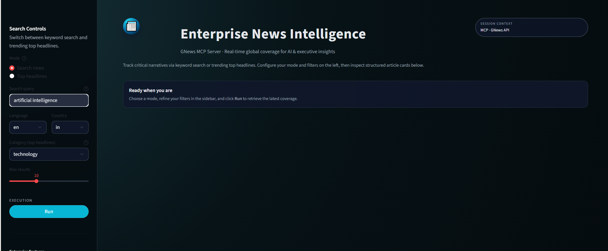
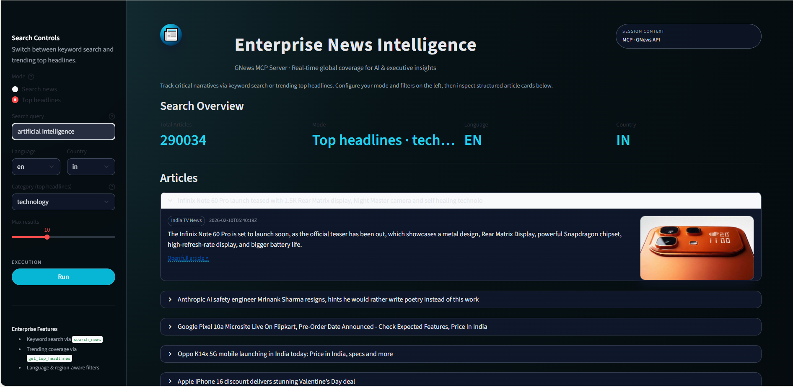

# GNews MCP Server

A Model Context Protocol (MCP) server that provides access to the GNews API for fetching news articles and headlines.

## Table of Contents

- [Introduction](#introduction)
- [Business Context](#business-context-and-problem)
- [Solution Overview](#solution-overview)
- [Features](#features)
- [Installation](#installation-and-setup)
- [Running the Server](#running-the-server)
- - [Quick Start (Local Demo UI)](#quick-start-local-demo-ui)
- [Integration](#integration-with-mcp-clients)
- [API Summary](#api-summary)
- - [Output Format](#output-format)
- [Before/After UI Preview](#beforeafter-ui-preview)
- [Advanced Queries](#advanced-query-capabilities)
- [Error Handling](#error-handling-and-rate-limits)
- [Use Cases](#example-use-cases)
- [Contributing](#contribution-and-licensing)

## Introduction

The GNews MCP Server is a Model Context Protocol (MCP) server that provides access to the GNews API for fetching news articles and headlines. It enables AI applications to search for news, get trending headlines, and access comprehensive news data through a standardized interface.

## Business Context and Problem

Many AI assistants and internal tools need up-to-date, reliable news information inside conversations or workflows. Directly integrating the GNews API into every client leads to:

- Duplicated effort across projects
- Inconsistent implementations
- Harder maintenance and updates

Teams require a reusable service that centralizes GNews authentication, query syntax, filters, and error handling.

## Solution Overview

The GNews MCP Server acts as a middle layer between MCP-compatible clients and the GNews REST API. It exposes news operations (search, top headlines, query help) as MCP tools and resources that any client can call over stdio.

### High-Level Architecture

- **MCP Client**: Claude Desktop or other MCP-compatible tools
- **GNews MCP Server**: Python process using stdio transport
- **GNews API**: External service secured with an API key from gnews.io

**Data Flow**:
```
Client sends tool request (e.g., search_news) 
→ Server validates parameters 
→ Server calls GNews API 
→ Server normalizes response 
→ Return structured articles
```

## Features

### Tools

The server defines two main MCP tools:

#### 1. `search_news`

Search for news articles using keywords with advanced filtering.

**Parameters**:
- `q` (required): Search query string with logical operators
- `lang` (optional): Language code (e.g., `en`, `es`, `hi`)
- `country` (optional): Country code (e.g., `us`, `in`, `gb`)
- `max` (optional): Number of articles (1-100, default 10)
- `in` (optional): Fields to search in (title, description, content)
- `nullable` (optional): Allow null values in specified fields
- `from`, `to` (optional): Date filters in ISO 8601 format
- `sortby` (optional): `publishedAt` or `relevance`
- `page` (optional): Page number for pagination

**Example Queries**:
```
Apple AND iPhone
Apple OR Microsoft
Apple NOT iPhone
(Apple AND iPhone) OR Microsoft
"Apple iPhone 15" AND NOT "Apple iPhone 14"
```

**Response**:
JSON with fields: `success`, `query`, `totalArticles`, `articles`, `parameters_used`

#### 2. `get_top_headlines`

Retrieve current trending news by category and region.

**Parameters**:
- `category` (optional, default: `general`): general, world, nation, business, technology, entertainment, sports, science, health
- `lang` (optional): Language code
- `country` (optional): Country code
- `max` (optional): Number of articles (1-100, default 10)
- `nullable` (optional): Allow null values in fields
- `from`, `to` (optional): Date filters
- `q` (optional): Additional search keywords
- `page` (optional): Page number

### Resources

The server exposes several resources that help construct correct and powerful queries:

- **`gnews://supported-languages`**: Returns a formatted list of supported language codes and names
- **`gnews://supported-countries`**: Returns a formatted list of supported country codes and names
- **`gnews://query-syntax`**: Provides comprehensive documentation for GNews query syntax, including logical operators and examples

### Prompt Utility

- **`create_news_search_prompt`**: Creates a structured, detailed research prompt for a specified topic and time window using `topic` and `days_back` parameters

## Installation and Setup

### Prerequisites

- Python environment (version managed via `.python-version` file in the repository)
- A valid GNews API key from [gnews.io](https://gnews.io)
- Git and basic command-line access

### Installation Steps

1. **Clone the repository**:
   ```bash
   git clone https://github.com/RzLetsCode/gnews-mcp-server.git
   cd gnews-mcp-server
   ```

2. **Install dependencies**:
   ```bash
   pip install -r requirements.txt
   ```
   or if using `uv`:
   ```bash
   uv sync
   ```

3. **Get a GNews API key**:
   - Sign up at [gnews.io](https://gnews.io)
   - Create a free account
   - Copy the API key from the dashboard

4. **Configure environment variables**:
   ```bash
   export GNEWS_API_KEY="your_api_key_here"
   ```

## Running the Server

The GNews MCP Server runs as a standard MCP stdio server.

**Development mode**:
```bash
python mcp_server.py
```

**Using uv**:
```bash
uv run mcp_server.py
```

Once started, the server listens on stdio for MCP requests from compatible clients and returns structured JSON responses.


## Quick Start (Local Demo UI)

This repository includes a minimal MCP client built with Streamlit so you can quickly test the GNews MCP Server end‑to‑end on your machine.

### 1. Start the MCP server

Make sure you have installed dependencies and set your `GNEWS_API_KEY` environment variable as described in the Installation section.

Then start the server:

```bash
python mcp_server.py
```

You should see logs similar to:

```text
2026-02-11 00:06:25,388 - __main__ - INFO - Starting GNews MCP Server...
2026-02-11 00:06:25,388 - __main__ - INFO - GNews API key found
```

At this point, the MCP server is ready to accept requests from MCP‑compatible clients.

### 2. Launch the Streamlit MCP client

In a separate terminal (with the same virtual environment activated), run:

```bash
streamlit run .\\mcp_client.py
```

Streamlit will start a local web app and show something like:

```text
  You can now view your Streamlit app in your browser.

  Local URL: http://localhost:8501
  Network URL: http://192.168.1.11:8501
```

Open the Local URL in your browser to interact with the MCP client UI, trigger `search_news` or `get_top_headlines`, and see how the structured JSON responses are rendered as a human‑friendly news feed.

> Tip: Keep the MCP server terminal open while you use the Streamlit UI so you can see request/response logs and error messages.
## Integration with MCP Clients

### Claude Desktop

To integrate with Claude Desktop:

1. Update `claude_desktop_config.json`
2. Add an entry under `mcpServers` named `gnews`
3. Set `command` to `python`
4. Set `args` to the absolute path to `mcp_server.py` in the gnews-mcp-server repository
5. Pass the `GNEWS_API_KEY` value through the `env` field

After configuration, Claude Desktop can call `search_news`, `get_top_headlines`, and use the resources during conversations.

### Other MCP Clients

Any MCP-compatible client that supports stdio transport can connect to the GNews MCP Server. Clients only need to implement the MCP protocol; the server hides all GNews HTTP and query complexity.

## API Summary

### search_news

**Purpose**: Search for news articles with advanced filters and boolean query support.

**Example Response**:
```json
{
  "success": true,
  "query": "Apple AND iPhone",
  "totalArticles": 45,
  "articles": [
    {
      "title": "Apple iPhone 15 Released",
      "description": "New features...",
      "url": "https://...",
      "source": "TechNews",
      "publishedAt": "2024-09-22T10:00:00Z",
      "image": "https://..."
    }
  ],
  "parameters_used": {...}
}
```

### get_top_headlines

**Purpose**: Retrieve current trending news by category and region.

The response structure is similar to `search_news`, focused on category-specific trending articles.

## Output Format

The MCP tools return a **normalized, structured JSON** payload that is easy to consume from any client.

### Common top-level fields

- `success`: Boolean indicating whether the request finished successfully
- `query`: Final query string executed against GNews
- `totalArticles`: Total number of articles returned by GNews for the query
- `articles`: List of article objects (see below)
- `parameters_used`: Echo of the validated and normalized parameters used in the call

### Article object structure

Each entry in `articles` follows the same shape:

```json
{
  "title": "Article title",
  "description": "Short summary of the article",
  "url": "https://source-website.com/article-path",
  "source": "SourceName",
  "publishedAt": "2024-09-22T10:00:00Z",
  "image": "https://image-url-if-available-or-null"
}
```

### Error response structure

Errors are also returned in a structured JSON format so clients can handle them programmatically.

```json
{
  "success": false,
  "error": "Invalid language code",
  "query": "Apple AND iPhone",
  "parameters_used": {
    "lang": "xx",
    "country": "us",
    "max": 10
  }
}
```

This makes it clear at a glance whether the operation succeeded and what parameters were actually used.

## Before/After UI Preview

You can use the included images to understand how the MCP integration looks in a typical client UI.

### Before search



This shows the initial state of the client before triggering any `search_news` or `get_top_headlines` call.

### After search



This shows the rendered results after a search, where the **structured JSON output** is transformed into a clean, human-readable news list.

## Advanced Query Capabilities

The GNews API supports sophisticated search expressions:

- **Logical operators**: `AND`, `OR`, `NOT` for combining or excluding terms
- **Phrase search**: Quotation marks for exact phrases (e.g., `"breaking news"`)
- **Operator precedence**: `OR` has higher precedence than `AND`; use parentheses for explicit grouping

**Example Complex Queries**:
```
(Tesla OR "electric vehicle") AND NOT "stock price"
Intel AND (i7 OR i9)
"artificial intelligence" AND NOT "machine learning"
```

## Error Handling and Rate Limits

The server implements multiple layers of error handling:

- **API key validation**: Checks that `GNEWS_API_KEY` is present before making requests
- **Parameter validation**: Verifies language codes, country codes, and numeric ranges
- **Network error handling**: Returns clear error messages for connectivity problems
- **API error mapping**: Surfaces GNews error messages in a structured format

**Error Response Example**:
```json
{
  "success": false,
  "error": "Invalid language code",
  "query": "...",
  "parameters_used": {...}
}
```

### Rate Limits

GNews enforces rate limits based on subscription plan:
- **Free plan**: 100 daily requests
- **Paid plans**: Higher limits

The server exposes informative errors when these limits are exceeded.

## Example Use Cases

Typical prompts in a client like Claude Desktop include:

1. **"Search for recent news about artificial intelligence developments in the last 3 days."**
   - Maps to `search_news` with appropriate filters

2. **"Get the top technology headlines from the United States."**
   - Maps to `get_top_headlines` with category and country filters

3. **"Find news articles about climate change, but exclude articles about politics."**
   - Maps to `search_news` with `AND NOT` operators

4. **"Show me breaking news about electric vehicles from European sources."**
   - Maps to `search_news` with country filters for European regions

## Contribution and Licensing

Developers can extend the GNews MCP Server by:

1. Forking the repository
2. Creating a feature branch
3. Implementing changes
4. Adding tests
5. Submitting a pull request

The project is licensed under the **MIT License**. See the repository's license information for details.

---

**Last Updated**: February 10, 2026
**Project**: GNews MCP Server
**Author**: RzLetsCode
